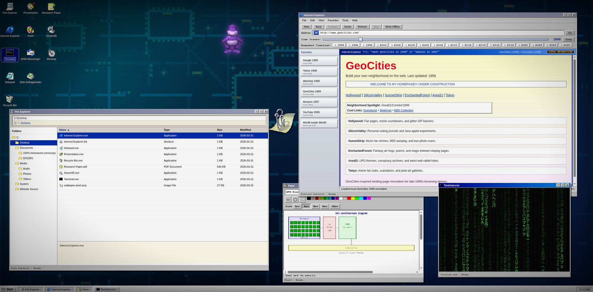

# From Pixels to Intelligence

An interactive Win95-style research project about the evolution of AI hardware, from CPUs to GPUs to purpose-built accelerators, and the social effects of that shift.

## License

This repository is licensed under the [Apache License 2.0](LICENSE).

## What’s Here

- `website/` - the browser-based presentation and desktop simulation
- `ops/` - local broker, proxy, and deployment scripts
- `IDS2891/` - course-era research artifacts and drafts

## Local Use

Open `website/index.html` directly in a browser, or serve the `website/` directory from any static web server.

For the local AI proxy:

- copy `.env.example` to a local `.env`
- set `OPENAI_API_KEY` only if you need the proxy to reach OpenAI
- keep the proxy on loopback unless you intentionally expose it
- treat `ops/cornerstone-cloudflared.yml` as a local template and replace the placeholders with your own tunnel settings

## Security Model

This project is designed for self-hosted use.

- The broker should keep secrets off the agent side.
- The proxy defaults to loopback-only binding.
- Private runtime values belong in local environment files, not in git.

## Contributing

See [CONTRIBUTING.md](CONTRIBUTING.md) for the development workflow and safety notes.
